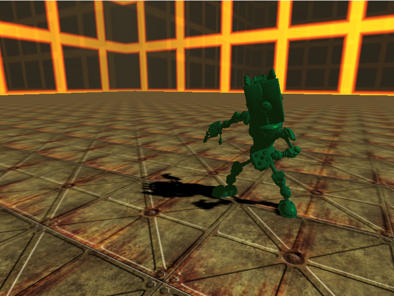
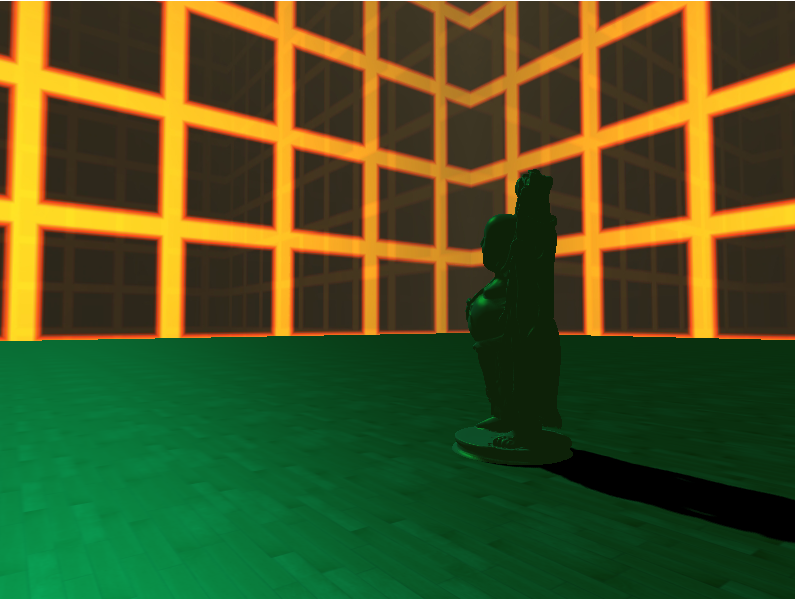
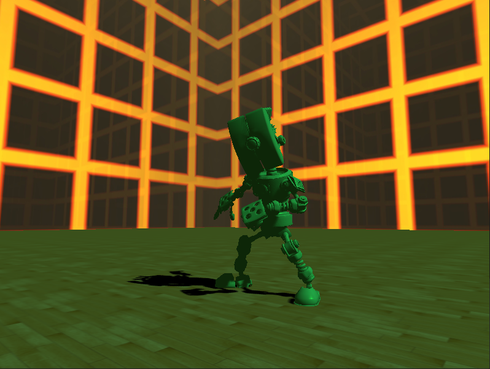

# object_loader_OGL
Starter code for any of my OpenGL projects. I currently use it to prototype any real time rendering algorithms I have quickly. Some screenshots can be found below

Special thanks to Davyd Vidige for the robot

## Installation instructions
This project uses Visual Studio 2019 Community Edition.
Here are the following prerequisites:
* OpenGL 3.3 or higher
* GLM 0.9.9.8
* GLAD with gl to 3.3 and Profile set to Core (go here: https://glad.dav1d.de/)
* GLFW 3.3.2
